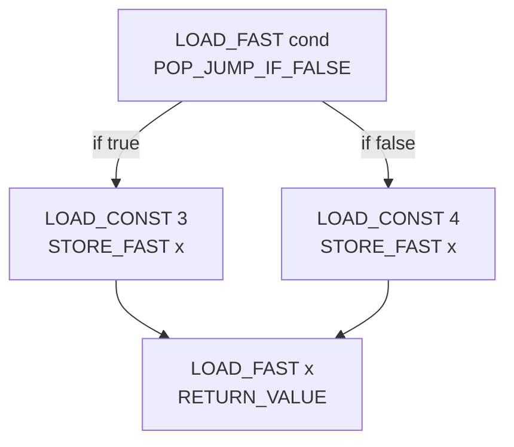
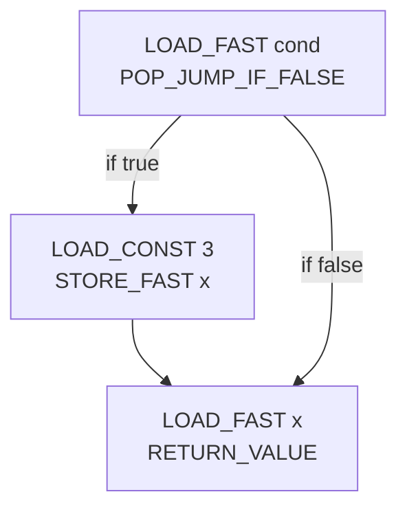
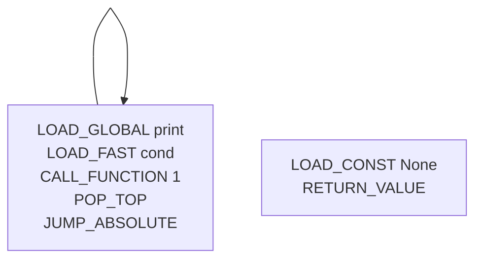

Python is kind of a funky language. It's very flexible about its variable
bindings, which is unusual. I think most of the difference comes from local
variables being function-scoped, where statements like `if` and `while` don't
introduce new scopes. Also that you can manually un-bind locals with the `del`
statement.

<!-- TODO -->

In this one, `x` is not defined in the body and assumed to be a global. You can
tell because there is a `LOAD_GLOBAL` in the bytecode.

```python
import dis
def test():
    return x
dis.dis(test)
#   3           0 LOAD_GLOBAL              0 (x)
#               2 RETURN_VALUE
```

In this one, because there is an assignment in the body---even though it is
after the variable use and technically dead code---the compiler infers `x` to
be a local. You can tell because there is a `LOAD_FAST` in the bytecode.

```python
import dis
def test():
  return x
  x = 1
dis.dis(test)
#   3           0 LOAD_FAST                0 (x)
#               2 RETURN_VALUE
```

So what happens if you run it? The compiler did not produce an error when
compiling this code so clearly the error must be handled at run-time---and
hopefully not be a segmentation fault.

```python
def test():
  return x
  x = 1
test()
# Traceback (most recent call last):
#   File "<stdin>", line 4, in <module>
#   File "<stdin>", line 2, in test
# UnboundLocalError: local variable 'x' referenced before assignment
```

Ah, a run-time exception. So there must clearly be some code in the interpreter
that checks, on every variable load, if the variable is defined. Let's peek
inside the interpreter loop. I'm looking at [the code from Python
3.8][py38loop], for reasons that I will explain later
(foreshadowing!)[^later-versions].

[py38loop]: https://github.com/python/cpython/blob/3.8/Python/ceval.c#L1333-L1344
[^later-versions]: It turns out that while I wasn't looking, in mid-2022,
    Dennis Sweeney [added this feature to CPython][cpython-analysis]. This is
    funny timing, since I originally started drafting this code and blog post
    in March 2022, then dropped it until April 2023.

[cpython-analysis]: https://github.com/python/cpython/issues/93143

```c
// Python/ceval.c
PyObject* _PyEval_EvalFrameDefault(PyFrameObject *f, int throwflag) {
// ...
main_loop:
    for (;;) {
    // ...
        switch (opcode) {
        // ...
        case TARGET(LOAD_FAST): {
            PyObject *value = GETLOCAL(oparg);
            if (value == NULL) {
                format_exc_check_arg(tstate, PyExc_UnboundLocalError,
                                     UNBOUNDLOCAL_ERROR_MSG,
                                     PyTuple_GetItem(co->co_varnames, oparg));
                goto error;
            }
            Py_INCREF(value);
            PUSH(value);
            FAST_DISPATCH();
        }
        // ...
        }
    }
    // ...
}
```

Yep. The interpreter reads the local given by the index in `LOAD_FAST`'s oparg
and then checks if it is `NULL`. This would happen if it was uninitialized or
explicitly deleted with `del`.

But most of the time this doesn't happen. Most of the time people don't write
silly code like this. It's not every day that you boot up some Python code and
hit this error. So we should be able to optimize for the common case: the
variables are initialized.

This is easy enough with straight-line code like this Fibonacci example from
[python.org](https://www.python.org/):

```python
def fib(n):
    a, b = 0, 1
    while a < n:
        print(a, end=' ')
        a, b = b, a+b
    print()
```

The variables `a` and `b` are initialized at the top and never deleted. They
are reassigned, sure, but they always are bound to some value. But it's not
always so obvious when a variable is defined. Sometimes the initialization
depends on some invariant in your code that you know about but have a hard time
demonstrating to the compiler. Something like `x` in this example, perhaps:

```python
def foo(cond):
    if cond:
        x = 123
    # ...
    if cond:
        print(x)
```

But most code isn't like that. Most code is pretty reasonable. So let's tackle
that. The goal is to replace instances of `LOAD_FAST` with a *definitely
assigned* local to some new opcode `LOAD_FAST_UNCHECKED`. We will ignore
reads of locals that might be defined, or are definitely not defined.

## Pre-reading

If you are not already familiar with control-flow graphs, I recommend reading a
previous blog post, [Discovering basic blocks][dbb], that builds a simple CFG
from Python bytecode. While we won't be using that exact data structure, we
will be using something very similar.

[dbb]: /blog/discovering-basic-blocks/

## Definite assignment analysis

If you do an internet search for "Definite assignment analysis" or "Data flow
analysis", you will get a bunch of confusing-looking equations (see page three
of [this CMU lecture][cmu-df] (PDF). Stuff like:

[cmu-df]: https://www.cs.cmu.edu/afs/cs/academic/class/15411-f21/www/lec/16-df-theory.pdf

```
In(s) = intersect(Out(s') for s' in pred(s))
Out(s) = union(Gen(s), In(s)-Kill(s))
```

where

```
pred(s) = {immediate predecessors of s}
In(s) = program point just before executing s
Out(s) program point just after executing s
Gen(s) = set of facts made true by s
Kill(s) = set of facts invalidated by s
```

It's a little scary looking but it's very approachable *if you tackle it piece
by piece*. I was put off by the formal-looking equations until writing this
post. It's more approachable if your `s` values are not entire statements but
instead much smaller chunks like Python bytecodes.

We'll come back to the exact equations but for now we will just try to build an
intuition with a bunch of code snippets.

### An informal approach

It's a good thing that you stopped and read [Discovering basic blocks][dbb],
because we're going to do some analysis over control-flow graphs. We'll start
with the simplest case: no control-flow.

Imagine a very digestible little Python function. I've disassembled it for you
but removed the explicit `dis` for clarity.

```python
def simple():
    a = 3
    b = 4
    c = a + b
    return c
#  2           0 LOAD_CONST               1 (3)
#              2 STORE_FAST               0 (a)
#
#  3           4 LOAD_CONST               2 (4)
#              6 STORE_FAST               1 (b)
#
#  4           8 LOAD_FAST                0 (a)
#             10 LOAD_FAST                1 (b)
#             12 BINARY_ADD
#             14 STORE_FAST               2 (c)
#
#  5          16 LOAD_FAST                2 (c)
#             18 RETURN_VALUE
```

This function assigns a value to first `a`, then `b`, then uses both `a` and
`b` to produce `c`, and then returns `c`. The bytecode is very similar to a
flattened version of the source code.

If we want to find out which variables are defined at their uses, we can go one
opcode at a time and learn facts from each of them. In this snippet I've
reproduced only the bytecode and added another column for what facts we know
about the variables.

```
             bytecode      defined variables
 0 LOAD_CONST     1 (3)        {}
 2 STORE_FAST     0 (a)        {a}

 4 LOAD_CONST     2 (4)        {a}
 6 STORE_FAST     1 (b)        {a, b}

 8 LOAD_FAST      0 (a)        {a, b}
10 LOAD_FAST      1 (b)        {a, b}
12 BINARY_ADD                  {a, b}
14 STORE_FAST     2 (c)        {a, b, c}

16 LOAD_FAST      2 (c)        {a, b, c}
18 RETURN_VALUE                {a, b, c}
```

We start off with no knowledge. There are no variables defined at the very top
and we know nothing about the variables that are yet to be defined. This is
represented by the empty set, `{}`.

You can see that at every `STORE_FAST` we learn that the variable it's storing
is now defined. This means that at every `LOAD_FAST`, we could use that
information to---if the variable is definitely defined---rewrite it to
`LOAD_FAST_UNCHECKED`. In this case, that's opcodes with offsets (number on the
left) `8`, `10`, and `16`.
<!-- TODO ^^ this might be jumping the gun -->

Things get a little bit more complicated when we add in `del`/`DELETE_FAST`.
Let's take a look at another code snippet to see how that would affect our
state.

```python
def a_del():
    a = 3
    b = 4
    del a
    c = a + b
    return c
#   2           0 LOAD_CONST               1 (3)
#               2 STORE_FAST               0 (a)
# 
#   3           4 LOAD_CONST               2 (4)
#               6 STORE_FAST               1 (b)
# 
#   4           8 DELETE_FAST              0 (a)     <-- new!
# 
#   5          10 LOAD_FAST                0 (a)
#              12 LOAD_FAST                1 (b)
#              14 BINARY_ADD
#              16 STORE_FAST               2 (c)
# 
#   6          18 LOAD_FAST                2 (c)
#              20 RETURN_VALUE
```

We have this new opcode in the middle that removes `a` from the set of defined
variables. Let's walk through the example.

```
             bytecode      defined variables
 0 LOAD_CONST     1 (3)        {}
 2 STORE_FAST     0 (a)        {a}

 4 LOAD_CONST     2 (4)        {a}
 6 STORE_FAST     1 (b)        {a, b}

 8 DELETE_FAST    0 (a)        {b}

10 LOAD_FAST      0 (a)        {b}
12 LOAD_FAST      1 (b)        {b}
14 BINARY_ADD                  {b}
16 STORE_FAST     2 (c)        {b, c}

18 LOAD_FAST      2 (c)        {b, c}
20 RETURN_VALUE                {b, c}
```

The `DELETE_FAST` opcode removes `a` from the set. This means that at offset
`10` we *must* check when we read from the locals table so that we can raise an
`UnboundLocalError` exception.

Now that we have covered the two fundamental operations that change or use our
state (`STORE_FAST` and `DELETE_FAST`), we can revisit the `Out` dataflow
equation again.

```
Out(s) = union(Gen(s), In(s)-Kill(s))
```

We'll split it by operation to make it clearer:

```
  opcode          Gen      Kill     Out
STORE_FAST  x     {x}      {}       union(In(s), {x})
DELETE_FAST x     {}       {x}      In(s)-{x}
```

In straight-line bytecode, each instruction only ever has one predecessor, so
`In(s)` is whatever state the previous bytecode operation produced. If you add
control-flow to the mix, things get a bit hairier---but only at basic block
boundaries! The first instruction in each block now may have multiple
predecessors.

You will notice that within a basic block, each instruction after the first one
only has one predecessor. This is because there is no control flow within a
basic block. This lets us only think about predecessors at the start of each
basic block.

### Adding in `if`

Most programs have conditional statements in them. Sometimes people even
conditionally assign variables. Take this fairly contrived example into
consideration:

```python
def conditional(cond):
    if cond:
        x = 3
    else:
        x = 4
    return x
#   2           0 LOAD_FAST                0 (cond)
#               2 POP_JUMP_IF_FALSE       10
# 
#   3           4 LOAD_CONST               1 (3)
#               6 STORE_FAST               1 (x)
#               8 JUMP_FORWARD             4 (to 14)
# 
#   5     >>   10 LOAD_CONST               2 (4)
#              12 STORE_FAST               1 (x)
# 
#   6     >>   14 LOAD_FAST                1 (x)
#              16 RETURN_VALUE
```

In both paths, `x` is defined. All paths to its only use, `return x`, define
`x`. Despite the `dis` module adding the helpful `>>` to indicate jump targets,
it can be tricky to construct the flow diagram in your head. So I've generated
a little visual:



The code is getting a little more complicated than before. We can no longer go
top to bottom in one pass. Our analysis needs to trace all reachable paths
through the control-flow graph and then merge abstract states at the join
points. But what does it mean to merge? Let's go back to the formal definition:

```
In(s) = intersect(Out(s') for s' in pred(s))
```

It means we have to take the intersection of the defined variables. In this
case, the intersection of `{cond, x}` and `{cond, x}` is the same set. But that
is not always the case. A one-armed `if` statment, for example, might only
define `x` sometimes:

```python
def conditional(cond):
    if cond:
        x = 3
    return x
#   2           0 LOAD_FAST                0 (cond)
#               2 POP_JUMP_IF_FALSE        8
# 
#   3           4 LOAD_CONST               1 (3)
#               6 STORE_FAST               1 (x)
# 
#   4     >>    8 LOAD_FAST                1 (x)
#              10 RETURN_VALUE
```

I've generated a handy visual again:



We can see that depending on the value of `cond`, the flow of control either
goes to the block that stores `3` into `x` or it jumps straight to the `return
x`. This means that we now have to account for two possible paths coming into
the final block.

If we look backwards from the block, we see two predecessors. In the true
branch, we define `x`. In the false branch, we don't. Because this is a
*definite* assignment analysis, we need to be sure about if something is
defined. So we have to go with the least amount of information we know. We have
to take the *intersection* of the two states. In this case, that's
`intersection({cond, x}, {cond})`, which is `{cond}`---and that does not
contain `x`.

**So the main takeaway is:** if at the beginning of a block, intersect the sets
of defined variables from all the predecessor blocks. Then do your analysis
normally on the rest of the block.

### Adding in `while`

To make matters worse, programs can have basic blocks that directly or
indirectly loop back to themselves. We call this a "loop" and you have probably
written one before[^params].

[^params]: I did not use a parameter in this function because there's a little
    thorny bit: parameters get defined as part of the entrypoint of the
    function, code that gets executed before anything else does. This means
    that even though there is only one block and it loops back to itself, there
    is a little implicit block that happens before any other blocks and that
    block defines all the parameters. To see how a real production compiler
    handles this, the Cinder JIT [explicitly adds a
    block](https://github.com/facebookincubator/cinder/blob/11a85b37bcfc82ae8f2e3f766cac2086d76c0e4b/Jit/hir/builder.cpp#L583-L590)
    to the IR if the first block is the start of a loop. It then goes through
    and explicitly [defines all the
    parameters](https://github.com/facebookincubator/cinder/blob/11a85b37bcfc82ae8f2e3f766cac2086d76c0e4b/Jit/hir/builder.cpp#L609).

```python
def loop():
    x = 3
    while True:
        print()
```

You might notice the dangling implicit `return None` at the end of the
bytecode. The CPython bytecode compiler guarantees that all functions will end
with a `RETURN_VALUE`, even if the source code does not contain a statement.
This leads to some apparently dead (unreachable) code, if you visualize it:



But that's not the interesting part. The interesting part is what happens when
you try to do definite assignment on this code. Let's try to do this the way we
have been doing:

1. Start at the top of the block. Merge defined variable sets from
   predecessors.
2. Analyze block.
3. Repeat.

Except, hm, the block has itself as a predecessor. How are we supposed to know
the output of the analysis on the block if we have not yet run the analysis?

It seems like we might want to give every block a default value for its output
and then refine it from there. And a safe default value is the empty set,
because we haven't run the analysis, so we can't guarantee anything. Let's try
that out.

The output


### Parameters

## Comparison with CPython 3.12

<hr style="width: 100px;" />
<!-- Footnotes -->
